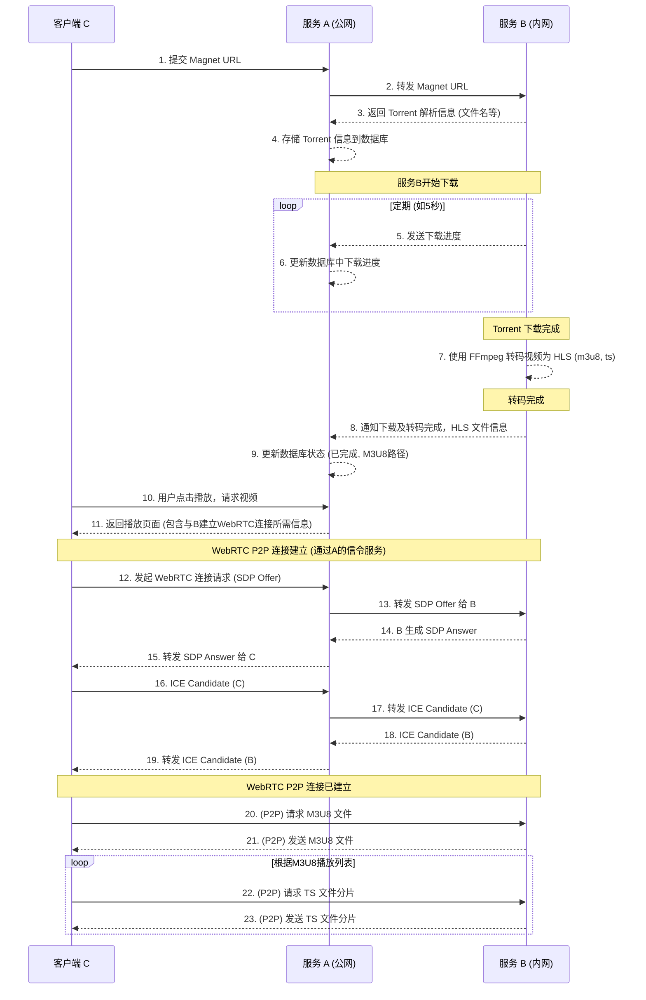

# 项目需求文档 (RPD) - TorrentM3U8 微服务

---

## 1. 项目概述

**TorrentM3U8** 是一个微服务项目，旨在提供一个通过 Magnet 链接下载 Torrent 文件，并将其转换为 M3U8 格式以便通过 WebRTC P2P 进行流媒体播放的解决方案。系统包含三个主要组件：

- **服务 A**（公网服务器，负责信令、API 和前端）
- **服务 B**（内网服务器，负责 Torrent 下载和文件转码）
- **客户端 C**（最终用户，通过浏览器访问服务）

---

## 2. 项目目标

- 允许用户通过客户端 C 提交 Magnet 链接。
- 服务 B 负责下载 Magnet 链接对应的 Torrent 文件。
- 服务 B 将下载完成的视频文件转换为 HLS（M3U8 播放列表和 TS 媒体流分片）。
- 服务 A 存储 Torrent 相关信息（如文件列表、下载进度、M3U8 地址等）。
- 客户端 C 能够通过服务 A 的信令服务与服务 B 建立 WebRTC P2P 连接，流畅播放转码后的视频内容。
- 提供一个用户友好的前端界面（在服务 A 上）供用户操作和查看状态。

---

## 3. 角色与职责

### 3.1 客户端 C (消费者)
- 与服务 A 的前端界面交互。
- 提交 Magnet 链接。
- 查看下载任务状态和进度。
- 发起视频播放请求。
- 通过 WebRTC 与服务 B 进行 P2P 通信以获取视频流。

### 3.2 服务 A (公网服务器)
- 部署信令服务器，协调 C 和 B 之间的 WebRTC 连接建立。
- 提供数据库 CRUD 服务，管理 Torrent 任务、文件信息、用户数据等。
- 提供前端用户界面。
- 接收 C 的请求，并与 B 通信。
- 维护与 B 的持久连接，接收来自 B 的状态更新。

### 3.3 服务 B (内网下载服务器)
- 运行 Torrent 下载客户端。
- 与服务 A 建立并维护持久连接。
- 接收并处理来自 A 的下载指令。
- 下载 Magnet 链接内容。
- 解析 Torrent 文件信息并上报给 A。
- 定期向 A 汇报下载进度。
- 下载完成后，使用 FFmpeg 将视频文件转换为 M3U8 格式。
- 作为 WebRTC 的 Peer 端，向客户端 C 提供 M3U8 和 TS 文件流。

---

## 4. 功能需求

### 4.1 用户交互 (客户端 C & 服务 A 前端)
- 用户能够输入或粘贴 Magnet 链接。
- 系统应能验证 Magnet 链接的有效性（基本格式）。
- 用户能够查看已提交的下载任务列表及其当前状态（等待、下载中、已完成、失败、转码中、可播放）。
- 用户能够查看特定任务的下载进度、文件名、大小等信息。
- 用户能够对已完成并转码的视频发起播放请求。
- 播放界面应提供基本的播放控制（播放/暂停、音量、进度条）。

### 4.2 Torrent 处理 (服务 A & 服务 B)
- 服务 A 接收到 Magnet 链接后，将其安全地转发给服务 B。
- 服务 B 解析 Magnet 链接，获取 Torrent 元数据（如文件名、文件列表、Tracker 信息）。
- 服务 B 将解析后的元数据发送给服务 A 进行存储。
- 服务 B 启动 Torrent 下载过程。
- 服务 B 每隔 5 秒向服务 A 发送当前下载任务的进度（下载速度、已下载百分比等）。
- 下载完成后，服务 B 通知服务 A。

### 4.3 视频转码 (服务 B)
- 视频文件下载完成后，服务 B 自动使用 FFmpeg 将其转换为 HLS 格式（生成一个 `.m3u8` 播放列表和多个 `.ts` 媒体分片文件）。
- 转码完成后，服务 B 通知服务 A，并提供 M3U8 文件的访问信息（相对路径或标识）。

### 4.4 流媒体播放 (服务 A 信令, 服务 B 数据, 客户端 C 播放)
- 客户端 C 请求播放特定视频时，服务 A 作为信令服务器，协助 C 与 B 建立 WebRTC P2P 连接。
- 服务 B 准备好通过 WebRTC 连接传输 M3U8 文件及对应的 TS 分片。
- 客户端 C 通过 P2P 连接从服务 B 获取 M3U8 文件，并根据 M3U8 文件内容逐步请求 TS 分片进行播放。

### 4.5 数据库 (服务 A)
- 存储 Magnet 任务信息：ID, Magnet URL, 添加时间, 状态。
- 存储 Torrent 文件信息：任务ID, 文件名, 文件大小, 文件在B上的存储路径。
- 存储下载进度：任务ID, 百分比, 下载速度, 上次更新时间。
- 存储 M3U8 信息：任务ID, M3U8 文件路径/标识。

### 4.6 持久连接 (服务 A & 服务 B)
- 服务 B 启动后主动与服务 A 建立持久连接（例如 WebSocket 或 gRPC）。
- 连接断开后，服务 B 应尝试自动重连。
- 服务 A 应能检测到与服务 B 的连接状态。

---

## 5. 非功能需求（初步）

### 性能
- Magnet 解析和任务启动应在数秒内完成。
- 下载进度更新应及时反映。
- 视频转码时间应在合理范围内（取决于视频大小和服务器 B 的性能）。
- P2P 视频流播放应流畅，延迟低。

### 可靠性
- 服务 A 和服务 B 之间的持久连接应稳定，并有重连机制。
- 下载和转码过程应能处理常见错误，并向用户报告状态。

### 可维护性
- 服务 A 和服务 B 的代码应模块化，易于维护和扩展。

### 安全性
- 对用户输入进行校验，防止恶意输入。
- （可选）考虑对 API 接口进行认证授权。

### 可扩展性
- 服务 A 应能处理一定并发量的用户请求和信令交互。
- （未来考虑）服务 B 的横向扩展以支持更多并发下载任务。

---

## 6. 系统架构

### 服务 A (Public Server)
- 技术栈: Go 后端, Nextjs 前端, WebSocket/Socket.IO (信令), SQlite (数据库)。gin web框架
- 部署在具有公网 IP 的服务器上。

### 服务 B (Download & Transcode Server)
- 技术栈: Go, github.com/anacrolix/torrent, FFmpeg。
- 部署在内网服务器，通过持久连接与服务 A 通信。

### 客户端 C (User's Browser)
- 标准 Web 浏览器，支持 HTML5, JavaScript, WebRTC。

---

## 7. 数据流图 (Mermaid)

---

## 8. 风险与挑战（初步）

- **网络穿透**：WebRTC 的 P2P 连接建立可能因 NAT 类型复杂而失败，需要有效的 STUN/TURN 服务器配置。服务 A 作为信令服务器，本身不直接参与媒体流传输，但 TURN 服务器可能需要公网IP且消耗带宽。
- **资源消耗**：Torrent 下载和视频转码是资源密集型操作，服务 B 的性能可能成为瓶颈。
- **版权问题**：用户下载内容的版权责任需要明确。
- **持久连接稳定性**：确保 A 和 B 之间的连接在各种网络环境下都能稳定工作。

---

请您仔细阅读以上内容，特别是关于各个组件的职责、功能点以及数据流转过程。期待您的反馈！
